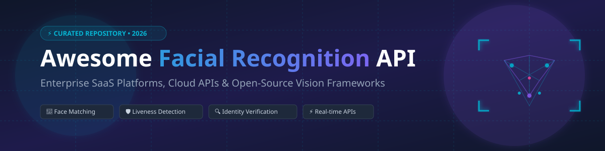

  

# 👁️ Awesome Facial Recognition API 🚀

  
  
  
  

> **A curated list of Enterprise SaaS Products, Cloud APIs, and Open-Source GitHub Projects for Face Detection, Face Matching, Liveness Detection, Biometric Search, and Identity Verification.**

Welcome to the definitive guide for **Facial Recognition APIs**! Whether you are building biometric KYC verification pipelines, smart access control systems, real-time video surveillance analytics, or user authentication flows, this repository brings together market-leading enterprise SaaS platforms and state-of-the-art open-source vision frameworks.

---

## 📖 Table of Contents

- [☁️ SaaS & Cloud Hosted Platforms](#%EF%B8%8F-saas--cloud-hosted-platforms)
- [🔓 Open-Source GitHub Repositories](#-open-source-github-repositories)
- [🤝 How to Contribute](#-how-to-contribute)
- [💖 Support & Sponsorship](#-support--sponsorship)
- [⚠️ Biometric Privacy & Legal Disclaimer](#%EF%B8%8F-biometric-privacy--legal-disclaimer)
- [⭐ Star History](#-star-history)

---

## ☁️ SaaS & Cloud Hosted Platforms

> **📊 Sector Overview**: The global facial recognition market size is estimated at **~$2.5 Billion in 2026** and projected to reach **~$6.8 Billion by 2030**. The sector is **moderately fragmented**: hyper-scaler cloud providers (**Amazon Web Services, Microsoft Azure, Google Cloud**) dominate general-purpose developer APIs, while specialized biometric firms (**Idemia, Megvii, Corsight AI, Paravision, Trueface**) lead high-precision NIST-benchmarked deployments for government, defense, border security, and enterprise identity verification.

The table below ranks commercial Facial Recognition SaaS providers by company scale (Annual Revenue / Market Valuation, descending):

| Platform | Description | Pricing (Starting Tier) | Free Tier / Trial Limits | Company Size (Revenue / Valuation) 🔽 |
| :--- | :--- | :--- | :--- | :--- |
| **[Amazon Rekognition Face](https://aws.amazon.com/rekognition/)** | AWS deep learning-based face detection, 1:N searching, and facial analysis. | **$0.001 per image** analyzed (first 1M images/month); **$0.00001/month per face stored**. | **5,000 images/month** for 12 months + **1,000 face metadata vectors stored free**. | **~$638 Billion** (Amazon FY2025 Revenue) |
| **[Microsoft Azure Face API](https://azure.microsoft.com/en-us/products/ai-services/ai-face)** | Azure AI service for face detection, 1:1 verification, identification, and liveness check. | **$1.00 per 1,000 transactions** (S0 Tier face detection/identification). | **20 transactions/minute free** (F0 Tier, max 30,000 transactions/month). | **~$281 Billion** (Microsoft FY2025 Revenue) |
| **[Face++ (Megvii)](https://www.faceplusplus.com/)** | Leading computer vision cloud platform for detection, landmarking, and comparison. | **$0.002 per API call** for pay-as-you-go credit packs. | **5,000 free calls/month** for face detection & 5,000 for face comparison (resets monthly). | **~$4.0 Billion** (Valuation Est.) |
| **[Idemia](https://www.idemia.com/)** | Global biometric identity leader for civil ID, border control, and public security. | **$15,000 per enterprise license deployment** (base deployment package). | **30-day enterprise sandbox evaluation** upon proof of business entity. | **~$2.2 Billion** (Annual Revenue Est.) |
| **[Kairos](https://www.kairos.com/)** | Identity verification and biometric recognition API for developers. | **$0.005 per API transaction** ($49/month starter plan includes 10k calls). | **100 free transactions total** upon registration (no credit card required). | **~$50 Million+** (Raised Capital) |
| **[Paravision](https://paravision.ai/)** | NIST top-ranked high-accuracy face recognition SDKs & cloud services. | **$0.003 per verification transaction** (minimum contract $1,000/month). | **14-day evaluation license** with sample dataset & SDK sandbox access. | **~$50 Million+** (Raised Capital) |
| **[Luxand](https://luxand.com/)** | Cloud face recognition API and cross-platform FaceSDK for identity verification. | **$19/month** for Luxand.cloud (includes 10,000 API operations). | **14-day free trial** with **300 API calls** on Luxand.cloud. | **Private SaaS** |
| **[Corsight AI](https://www.corsight.ai/)** | High-precision facial recognition optimized for edge cameras & masked faces. | **$1.20 per enrolled face profile / year** (base 2,000 database license unit). | **30-day POC license** for up to 50 enrolled test subject profiles. | **Private Startup** |
| **[Trueface (Pangiam)](https://pangiam.com/)** | NIST-compliant fast face recognition for Docker container & on-premise cloud deployment. | **$250/month** per stream or container deployment unit. | **30-day full container trial license** for non-production development. | **Acquired by Pangiam** |

---

## 🔓 Open-Source GitHub Repositories

Explore production-grade open-source facial recognition frameworks, pre-trained models (ArcFace, FaceNet, RetinaFace), and Docker microservices ranked by GitHub Stars_Count (descending):

| Repository | Description | GitHub_Stars 🔽 |
| :--- | :--- | :--- |
| **[InsightFace](https://github.com/deepinsight/insightface)** | **State-of-the-art 2D/3D face analysis toolkit.** Provides ArcFace loss embeddings, SCRFD face detection, PySide6 desktop GUI evaluation studio, 1:N biometric search, and face swapping algorithms. (Python, C++, ONNX, PyTorch) — **MIT License** |  |
| **[DeepFace](https://github.com/serengil/deepface)** | **Lightweight facial recognition and facial attribute analysis framework.** Wraps VGG-Face, Google FaceNet, OpenFace, ArcFace, Dlib, and SFace with built-in anti-spoofing / liveness detection modules and REST API support. (Python) — **MIT License** |  |
| **[MediaPipe](https://github.com/google-ai-edge/mediapipe)** | **Google cross-platform ML solution.** High-speed, real-time face detection, 468 3D facial landmark mesh tracking, and iris tracking optimized for mobile devices, web, and edge hardware. (C++, Python, JS, Android, iOS) — **Apache-2.0** |  |
| **[Face Recognition](https://github.com/ageitgey/face_recognition)** | **World's simplest face recognition API for Python & CLI.** Built on dlib's state-of-the-art face recognition with 99.38% accuracy on LFW benchmark. Provides simple image matching and real-time webcam face detection. (Python) — **MIT License** |  |
| **[FaceNet](https://github.com/davidsandberg/facenet)** | **TensorFlow implementation of Google FaceNet.** Unified embedding architecture for face recognition, verification, and clustering trained on LFW and CASIA-WebFace datasets. (Python) — **MIT License** |  |
| **[CompreFace](https://github.com/exadel-inc/CompreFace)** | **Free and open-source Docker-based face recognition system by Exadel.** Integrates easily without ML expertise via RESTful APIs for face detection, verification, age/gender estimation, and landmark analysis. (Java, Python, Docker) — **Apache-2.0** |  |
| **[Facenet-PyTorch](https://github.com/timesler/facenet-pytorch)** | **Pretrained PyTorch face detection (MTCNN) and recognition (InceptionResnetV1) models.** Optimized for fast CPU/GPU batch inference with PyTorch. (Python) — **MIT License** |  |
| **[SeetaFace2](https://github.com/SeetaFaceEngine/SeetaFace2)** | **Open-source C++ face recognition engine.** Supports face detection, 5-point landmark alignment, and face identification with high computational efficiency on CPU. (C++) — **BSD-3-Clause** |  |
| **[UniFace](https://github.com/yakhyo/uniface)** | **All-in-one face analysis toolkit.** Features ONNX Runtime acceleration, 106-point facial landmarks, ArcFace & MobileFace recognition embeddings, and age/gender estimation. (Python) — **MIT License** |  |
| **[FaceX-Zoo](https://github.com/JDAI-CV/FaceX-Zoo)** | **PyTorch-based open-source face recognition toolbox by JD AI.** Designed for training state-of-the-art face recognition backbones and evaluating biometric head posture, occlusions, and passive liveness. (Python) — **Apache-2.0** |  |

---

## 🤝 How to Contribute

Contributions are welcome! If you know of an enterprise SaaS platform or open-source facial recognition project that should be listed:

1. **Fork** this repository.
2. Add your suggested entry to `README.md` following the tabular format.
3. Ensure accuracy in starting tier pricing, free tier limits, and GitHub stargazer links.
4. Open a **Pull Request** with a brief summary of the added solution.

---

## 💖 Support & Sponsorship

If you find this curated resource helpful for your computer vision projects, identity verification workflows, or tech research, please consider supporting the project:

- 🌟 **Star this repository** to increase its visibility.
- 🔀 **Fork & Share** with fellow computer vision engineers and AI architects.
- ☕ **Sponsor the Maintainer**: Support ongoing open-source curation and development via [GitHub Sponsors](https://github.com/sponsors/ishandutta2007).

---

## ⚠️ Biometric Privacy & Legal Disclaimer

- **Biometric Compliance**: Facial recognition processing involves sensitive biometric data governed by strict global regulations, including **GDPR (EU)**, **BIPA (Illinois, USA)**, **CCPA/CPRA (California)**, and national AI privacy acts. Ensure user consent, data encryption, and retention policies adhere to legal requirements prior to deployment.
- **Accuracy & Bias**: Biometric accuracy varies based on lighting, camera resolution, occlusion, and demographic representation. Always benchmark models using NIST FRVT or domain-specific datasets before production use.

---

## ⭐ Star History

